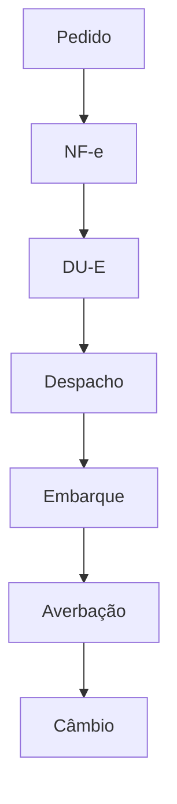

## Resumão para quem está começando

1. **Habilite sua empresa** no Radar Express (limite US$ 50 mil/ano).
2. **Escolha um produto** com vantagem competitiva e NCM confirmado.
3. **Pesquise mercado** no ITC Trade Map: demanda, preço, barreiras.
4. **Simule custos** com o Simulador OLV para definir preço FOB/CIF.
5. **Participe de programa** _PEIEX_ ou _Exporta Fácil_ dos Correios.
6. **Feche primeiro contrato** pequeno (≤ US$ 10 mil) usando Incoterm CPT.
7. **Contrate trading** se ainda não tiver experiência em DU-E.

### Fluxo documental simplificado

### Check-list de custos iniciais

| Item | Custo estimado |
| --- | --- |
| Radar Express | R$ 0 (online) |
| Tradução de rótulo | R$ 800 |
| Despachante exportação | R$ 1.500 |
| Frete courier 30 kg | US$ 320 |

### Mini-FAQ

| Pergunta | Resposta breve |
| --- | --- |
| MEI pode exportar? | Sim, via Correios Exporta Fácil até US$ 50 k/ano. |
| Preciso de Certificação de Origem? | Apenas se houver acordo tarifário (ex.: Mercosul). |
| Como receber pagamento? | Use adiantamento (CAD) ou carta de crédito para reduzir risco. |

---

### Fontes

* Correios – Exporta Fácil Manual 2024
* ITC – Trade Map Guia de Uso
* RFB – IN 1.984/2020

> Conteúdo auditado OLV Labs, Julho 2025. 