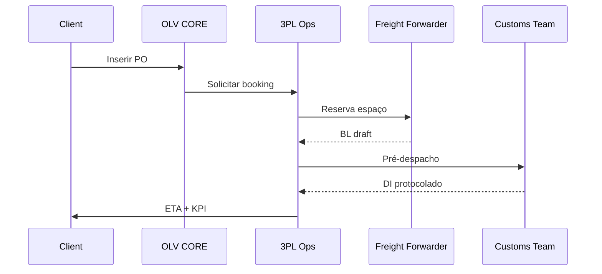

## Resposta rápida

Nossa solução **3PL Turnkey** integra armazenagem, transporte internacional e desembaraço em um único contrato, reduzindo até 18 % do custo logístico total e cortando 12 dias de lead-time médio.

---

### Escopo 3PL (Importação & Exportação)

| Módulo             | KPI alvo             | Sistema         |
| ------------------ | -------------------- | --------------- |
| Armazenagem bonded | OTIF 99 %            | WMS–OLV Cloud   |
| Freight management | Redução de frete 8 % | RateOptimizer® |
| Desembaraço        | Liberação < 24 h     | ComplianceHub   |

### Fluxo operacional "One-Touch"

### Indicadores entregues

• Custo logístico por kg  
• % embarques green-lane  
• CO₂ por tonelada (para ESG)

### Modelo comercial

1. **Retainer + variável**: fee fixo a partir de R$ 7 k/mês + até 1,2 % do CIF.
2. **Performance pack**: desconto 15 % se KPI de savings < meta.

### Onboarding em 4 semanas

| Semana | Atividade                  | Responsável |
| ------ | -------------------------- | ----------- |
| 1      | Kick-off & desenho de rota | PM OLV      |
| 2      | Integração EDI             | TI          |
| 3      | Teste piloto 1 contêiner   | 3PL         |
| 4      | Go-live full lanes         | Todos       |

---

## Perguntas frequentes adicionais

1. **Posso usar meus próprios fornecedores?** Sim, sistema multi-carrier.
2. **Existe SLA de espaço em alta temporada?** Garantia de 95 % para rotas contratadas com 30 dias de antecedência.

---

## Veja também

- [Logística 3PL vs 4PL – diferenças](/answers/freight-forwarder-3pl-4pl)
- [Demurrage & Detention – como evitar multas](/answers/demurrage-e-detention)
- [Booking & Cut-off – checklist completo](/answers/booking-e-cut-off-logistica-internacional)

### Próximo passo

Precisa de uma proposta personalizada? [Fale com nossos consultores](https://api.olvinternacional.com.br/contato) ou teste o [Simulador de Custo de Importação](/simuladores/importacao).

---

> Última revisão: Julho 2025.
