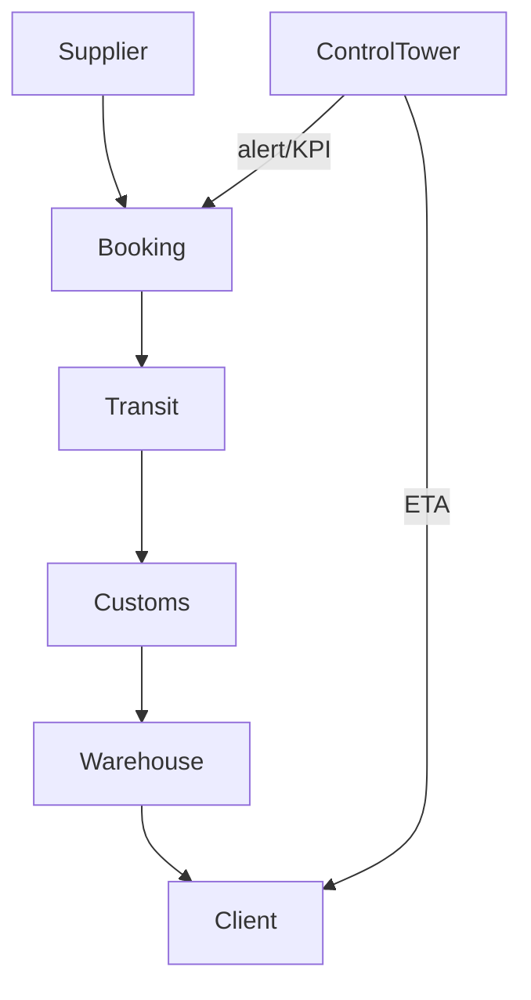

## Resposta rápida

Nosso **serviço 4PL Torre de Controle** assume 100 % da gestão COMEX: planejamento, execução, analytics e melhoria contínua – tudo medido por KPIs compartilhados e com IA de roteirização conectada ao SeaRates.

---

### O que está incluído

| Pilar         | Descrição                            | Ferramenta        |
| ------------- | ------------------------------------ | ----------------- |
| Plan & Source | Sourcing global, RFQ multicurrency   | CORE Sourcing     |
| Move          | Booking multimodal + consolidação    | SeaRates API      |
| Clear         | Desembaraço full + regimes especiais | ComplianceHub     |
| Deliver       | Última milha + VMI                   | 3PL Network       |
| Improve       | Kaizen, Dashboard KPI                | Control Tower 4PL |

### SLA principais

• OTIF ≥ 97 %  
• Redução de demurrage em 30 dias  
• Savings frete alvo 10 % YoY.

### Fluxo de controle

### Plano financeiro

| Faixa TEU/ano | Retainer mensal     | % sobre savings |
| ------------- | ------------------- | --------------- |
| 50–200        | a partir de R$ 12 k | 20 %            |
| 201–500       | a partir de R$ 22 k | 18 %            |
| 500+          | on demand           | 15 %            |

---

## Perguntas frequentes adicionais

1. **Preciso mudar de sistemas?** Não; integramos via API e EDI.
2. **Relatórios ESG incluídos?** Sim, CO₂/ton emitido por embarque.

---

## Veja também

- [Especialistas on-demand](/answers/especialistas-em-comex)
- [Logística 3PL Turnkey](/answers/logistica-3pl-para-exportacao)
- [Free Time & Storage portuário](/answers/free-time-e-storage-portuario)

### Próximo passo

Agende uma call de 15 min: [Contato](https://api.olvinternacional.com.br/contato).

---

> Última revisão: Julho 2025.
